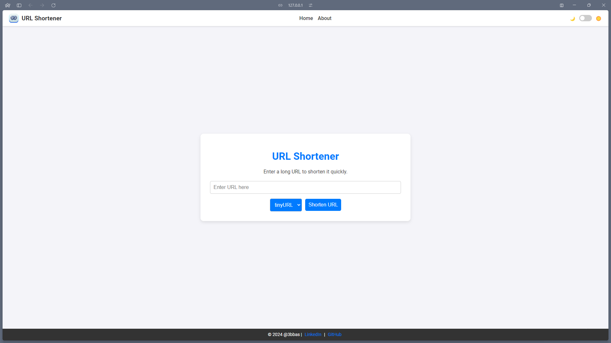
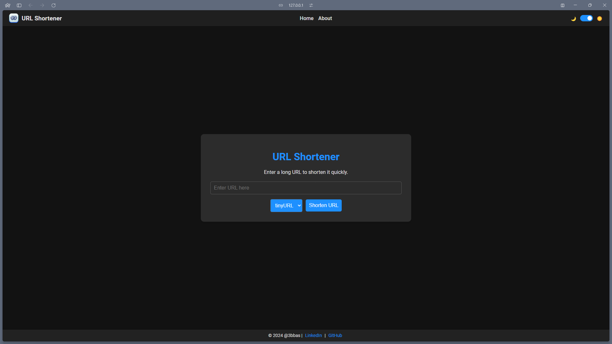

# URL Shortener

A simple Django-based web application that allows users to shorten long URLs using various URL shortening services. This
project utilizes the `pyshorteners` library to interact with different URL shortening APIs and provides a user-friendly
interface for quick URL shortening.

**Deployment**: [Link](https://3bbas-shorturl.vercel.app)

## Features

- **Multiple URL Shortening Services**: Supports TinyURL, Bitly, Chilp.it, Clck.ru, Cutt.ly, Da.gd, and Is.gd.
- **URL Validation**: Ensures the provided URL is valid and not already shortened.
- **Responsive Design**: User-friendly interface adaptable to different screen sizes.
- **Theme Toggle**: Light and dark mode support with a toggle switch.
- **Automatic Clipboard Copy**: Click the shortened URL to copy it to your clipboard.
- **Auto-clear Result**: Shortened URL result disappears after 30 seconds for a cleaner interface.

## Demo

*(Coming Soon!)*

## Screenshots

|                                  Light theme                                  |                                 Dark Theme                                  |
|:-----------------------------------------------------------------------------:|:---------------------------------------------------------------------------:|
|  |  |

## Prerequisites

- Python 3.7 or higher
- Django 3.2 or higher
- `pyshorteners` library
- API keys for Bitly and Cutt.ly (if you intend to use these services)

## Installation

1. **Clone the repository**:

   ```bash
   git clone https://github.com/yourusername/url_shortener.git
   cd url_shortener```

2. **Create a virtual environment**:
   ```bash
   python -m venv venv```

3. **Activate the virtual environment**:

- On Windows:
  ```bash
  venv\Scripts\activate```
- On macOS or Linux:
  ```bash
  source venv/bin/activate```

4. **Install dependencies**:
   ```bash
   pip install -r requirements.txt```

5. **Set up environment variables**:

    - Create a .env file in the root directory.
    - Add the following variables:
      ```dotenv
      SECRET_KEY=your_django_secret_key
      BITLY_API_KEY=your_bitly_api_key
      CUTLLY_API_KEY=your_cuttly_api_key```

   > [!NOTE]  
   > If you don't have API keys for Bitly or Cutt.ly, you can leave them empty or remove related options from the
   application.

6. **Apply migrations**:
    ```bash
    python manage.py migrate```

7. **Run the development server**:
    ```bash
    python manage.py runserver```

8. **Access the application**:

   Open your web browser and navigate to http://127.0.0.1:8000/.

### Usage:

1. **Shorten a URL**:

- Enter the long URL you wish to shorten in the input field.
- Select your preferred URL shortening service from the dropdown menu.
- Click on "Shorten URL".

2. **Copy Shortened URL**:

- The shortened URL will be displayed.
- Click on the shortened URL to copy it to your clipboard.
- A tooltip "Copied to clipboard!" will appear upon successful copy.

3. **Theme Toggle**:

- Use the toggle switch in the navigation bar to switch between light and dark modes.
- Your theme preference will be remembered for future visits

### **Project Structure**:

```shell
url_shortener/
├── manage.py
├── requirements.txt
├── url_shortener/
│   ├── __init__.py
│   ├── asgi.py
│   ├── settings.py
│   ├── urls.py
│   ├── views.py
│   ├── wsgi.py
├── static/
│   └── url_shortener/
│       ├── fav-icon.ico
│       └── logo.png
├── templates/
│   └── home.html
```

### **Technologies Used**:

- **Django**: High-level Python web framework.
- **PyShorteners**: Python library for shortening URLs via various services.
- **HTML5 & CSS3**: For structuring and styling the web pages.
- **JavaScript**: For dynamic interactions on the front-end.

### Contributing

    Contributions are welcome! If you have suggestions for improvements or would like to report a bug, please open an issue or submit a pull request.